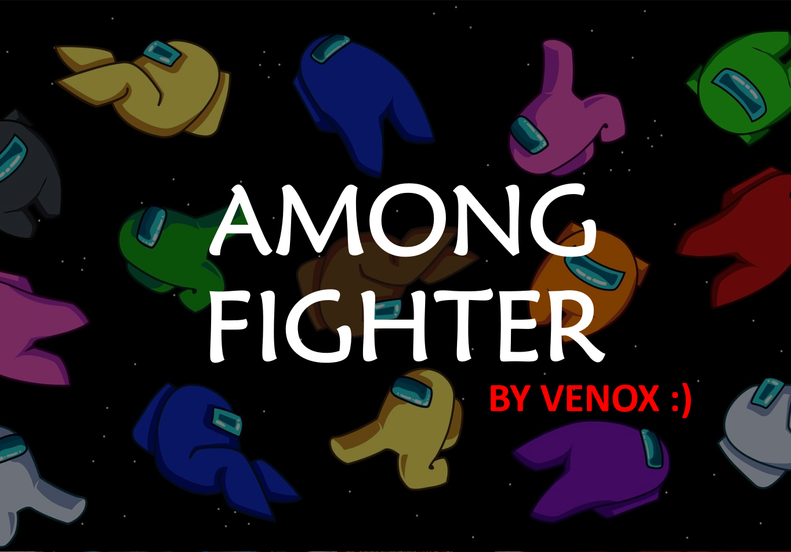
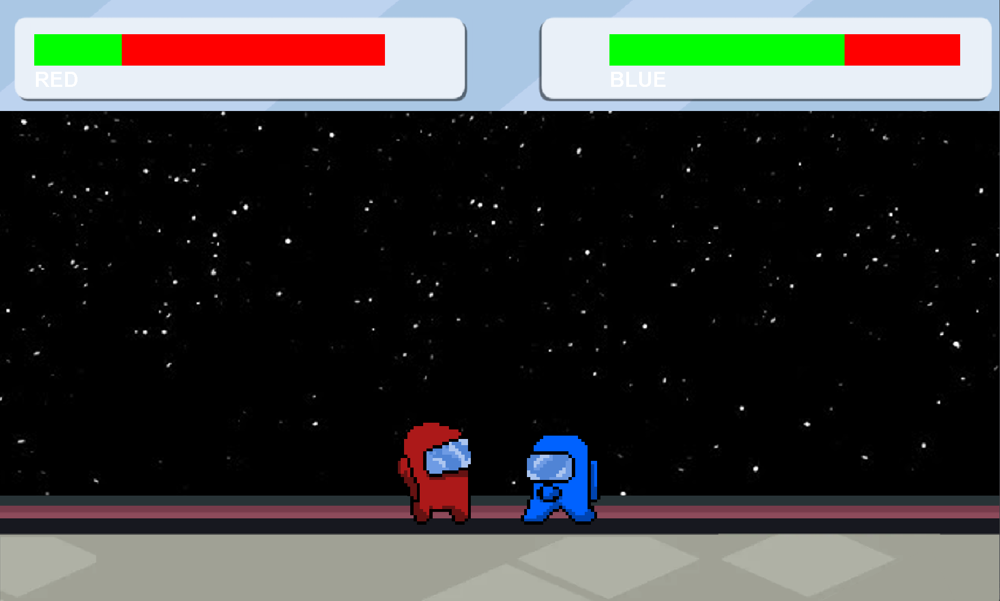

# AMONG FIGHTER

## Introduction

Welcome to "AMONG FIGHTER - VENOX," a 2D fighting game implemented in Java using the Swing framework. This simple game allows two players, represented by red and blue characters, to engage in combat with various moves and attacks.

## How to Play


*Figure 1: Splash Screen*


*Figure 2: Game Frame*

3. **Controls:**
   - **Red Player:**
     - Move left: **Left Arrow Key**
     - Move right: **Right Arrow Key**
     - Jump: **Up Arrow Key**
     - Kick: **K**
     - Punch: **L**

   - **Blue Player:**
     - Move left: **A**
     - Move right: **D**
     - Jump: **W**
     - Kick: **Q**
     - Punch: **E**

4. **Gameplay:**
   - Players can move left, right, jump, and perform different attacks.
   - Attacks include punches and kicks.
   - Colliding with an opponent results in damage.
   - The game ends when one player's health reaches zero.

5. **Health and Power:**
   - Each player has a health bar displayed on the screen.
   - Power boxes for each player indicate their remaining health.

## Development Details

- **Technology:**
  - The game is developed in Java using the Swing framework for GUI.
  - Object-oriented programming principles are followed for code organization.

- **Code Structure:**
  - The game code is organized into several classes:
    - `SplashScreen`: Displays the initial splash screen.
    - `GameFrame`: Main game frame where the gameplay occurs.
    - `Board`: Manages the game board, player interactions, and collisions.
    - `RedPlayer` and `BluePlayer`: Represent the red and blue player characters.
    - `Sprite`: Abstract base class for player sprites, providing common attributes and methods.

## How to Run

1. Compile the Java files using a Java compiler.
2. Run the `SplashScreen` class to start the game.

```bash
javac *.java
java SplashScreen
```


## Acknowledgments

 - The game assets (images) are sourced from external files (bg.jpeg, red.png, blue.png).

 - Feel free to explore, modify, and have fun playing "AMONG FIGHTER - VENOX"!
